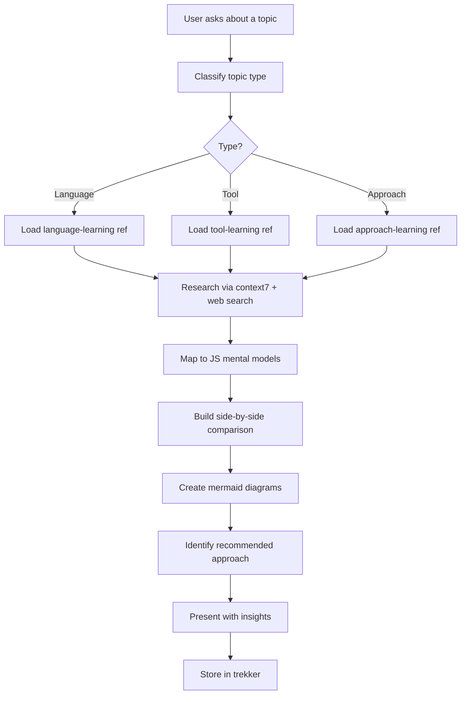
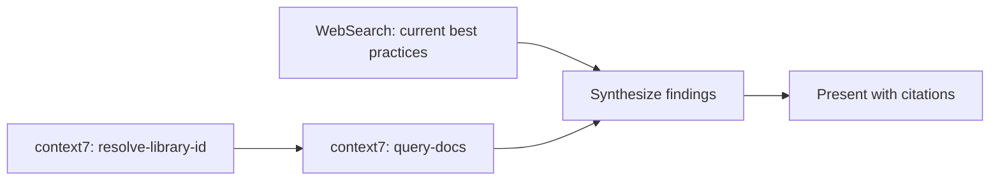
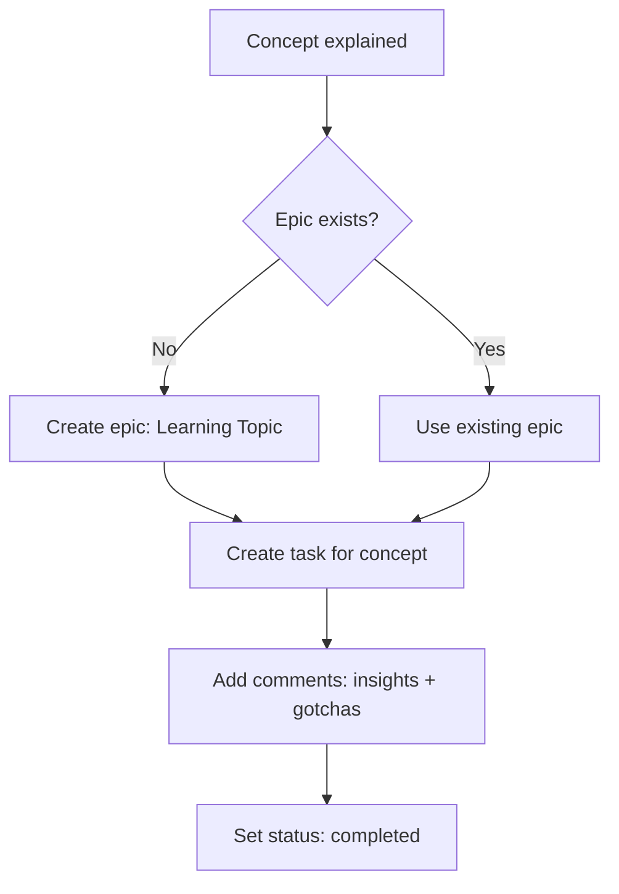

# Assisted Learning

Teach new technologies to JavaScript developers through side-by-side comparisons, mermaid diagrams, real-world examples, and industry-standard recommendations. Store learning progress in trekker for cross-session continuity.

**Target audience:** JavaScript/TypeScript developers.
**Output:** Explanations, comparisons, diagrams, insights. NOT code generation or scaffolding.

---

## Workflow



## Topic Classification

Determine which type the user is learning:

| Type | Signal | Reference File |
|------|--------|---------------|
| **Language** | "learn Elixir", "Swift vs JS", "Go syntax" | [language-learning.md](references/language-learning.md) |
| **Tool** | "how does K8s work", "explain Docker", "Redis" | [tool-learning.md](references/tool-learning.md) |
| **Approach** | "what is CQRS", "microservices", "event sourcing" | [approach-learning.md](references/approach-learning.md) |

Load the matching reference file for templates and patterns. If mixed (e.g., "learn Elixir's OTP supervision" = language + approach), load both.

## Core Process

### Step 1: Check Trekker for Prior Learning

Before teaching, check if the user has learned this topic before:

```
trekker search "[topic]" --type epic,task,comment
```

If prior learning exists, resume from where they left off. Do NOT re-explain understood concepts.

### Step 2: Research First

Do NOT rely solely on trained knowledge. Always verify with live sources.



- **context7** — `resolve-library-id` then `query-docs` for official documentation, API references, code examples
- **WebSearch** — current best practices, community conventions, recent changes, version-specific info

Refresh knowledge every session. APIs change, conventions evolve, libraries get deprecated.

### Step 3: Map to JS Mental Models

Find the closest JavaScript concept for everything.

**Rules:**
- Every new concept MUST have a JS comparison (or explicit "no JS equivalent — new concept")
- Use the developer's vocabulary: "Think of X as Y but with Z difference"
- Start from what they know, bridge to what they don't
- Acknowledge where the analogy breaks down

### Step 4: Side-by-Side Comparison

Follow the comparison template from the loaded reference file.

**Structure every comparison as:**
1. JS approach (what you know)
2. Target approach (what's new)
3. Key difference (the paradigm shift)
4. Gotcha (common mistake JS devs make)
5. Industry standard (which way passes code review)

### Step 5: Mermaid Diagrams

Include at least one mermaid diagram per major concept:

| Context | Diagram Type | Use For |
|---------|-------------|---------|
| Architecture | `flowchart` | System structure, data flow |
| Lifecycle | `sequenceDiagram` | Request/response, event flow |
| Decision | `flowchart` with diamonds | When to use X vs Y |
| Comparison | `flowchart` with subgraphs | Before/after, JS vs target |
| State | `stateDiagram-v2` | State machines, lifecycle |

### Step 6: Recommend with Reasoning

When multiple solutions exist:

- Present all viable options
- Mark **recommended** with reasoning
- Evaluate from **tech lead perspective** — what passes code review
- Consider: performance, maintainability, community convention, ecosystem support
- State explicitly when the "simple" option is the right choice

### Step 7: Store in Trekker

See [trekker-learning-db.md](references/trekker-learning-db.md) for full patterns.



After teaching a concept:
1. Search if learning epic exists: `trekker search "[topic]" --type epic`
2. Create epic if new: `trekker epic create -t "Learning [Topic]"`
3. Create task: include JS equivalent and key insight in description
4. Add comments: detailed notes, gotchas, resource links
5. Mark completed after explaining

## Insight Format

```
> **Insight:** [Concise, valuable observation]
> **JS Bridge:** [How this connects to JS knowledge]
> **Tech Lead Take:** [Industry perspective — what matters in production]
```

Focus on insights that are non-obvious, practical, and opinionated.

## Anti-Patterns

- Do NOT generate project scaffolding or boilerplate
- Do NOT provide code walls without explanation
- Do NOT skip the JS comparison — it's the core value
- Do NOT present options without a recommendation
- Do NOT use trained knowledge alone — always research with context7/WebSearch
- Do NOT dump all concepts at once — follow priority order in reference files
