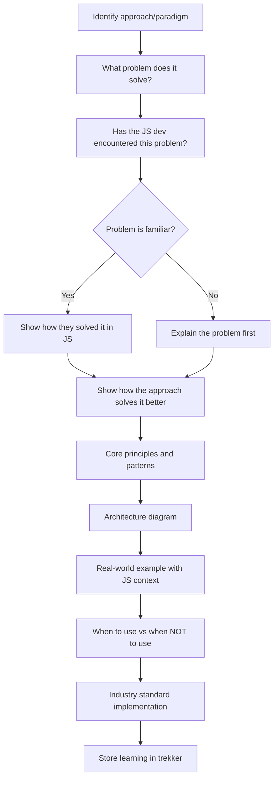
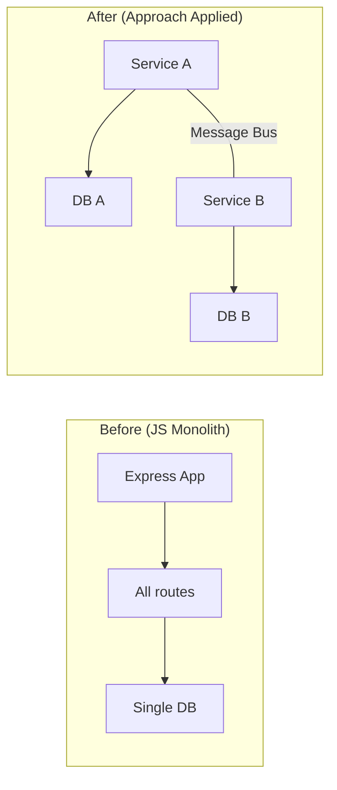
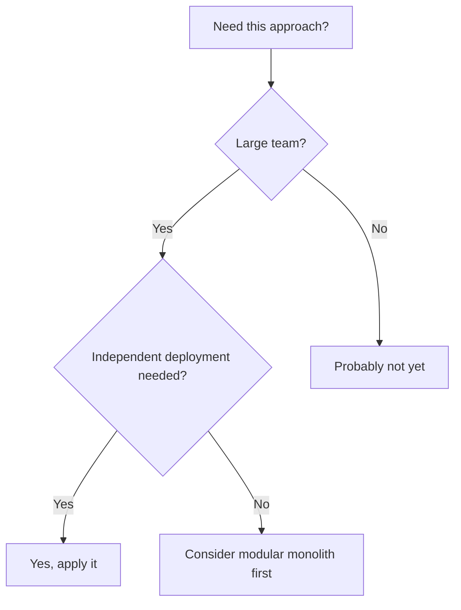
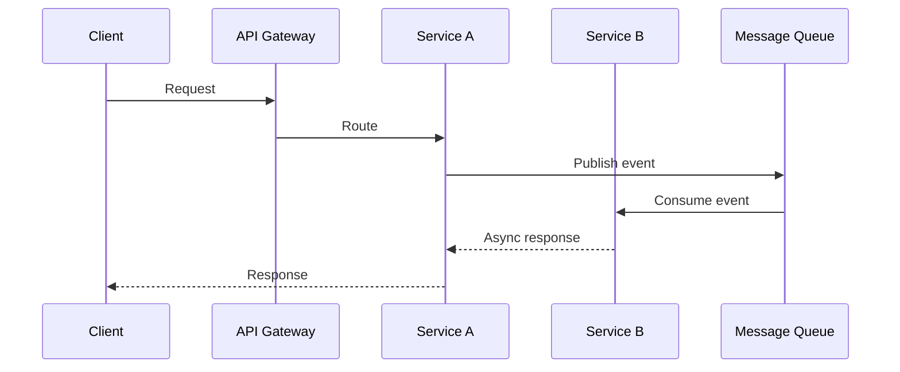

# Approach & Paradigm Learning — JS Developer Bridge

## Table of Contents
- [Teaching Flow](#teaching-flow)
- [Approach Explanation Template](#approach-explanation-template)
- [Common Approaches for JS Devs](#common-approaches-for-js-devs)
- [Diagram Patterns](#diagram-patterns)

---

## Teaching Flow



## Approach Explanation Template

```markdown
## [Approach Name]

### The Problem It Solves
**In JS terms:** [Problem the JS dev has encountered]
**Without this approach:** [What goes wrong at scale]
**With this approach:** [What improves]

### Core Principles

\`\`\`mermaid
[Diagram showing the approach's architecture]
\`\`\`

| Principle | Explanation | JS Analogy |
|-----------|-------------|------------|
| [principle] | [what it means] | [closest JS concept] |

### How JS Devs Already Use This (Without Knowing)
[Show where this pattern exists in the JS ecosystem — e.g., "Event-driven architecture? You already use it with EventEmitter and DOM events"]

### Full Implementation Pattern
[Step-by-step of how to properly implement this approach]

### When to Use
- [Scenario 1]
- [Scenario 2]

### When NOT to Use
- [Anti-pattern 1 — with reasoning]
- [Anti-pattern 2 — with reasoning]

### Industry Standard
**Recommended stack/tooling:** [Specific tools and why]
**Avoid:** [Common mistakes in production]

### Tech Lead Perspective
[Would this pass a PR review? What questions would a tech lead ask?]
```

## Common Approaches for JS Devs

Map learning priority based on career growth:

| Approach | JS Dev Already Knows | What's New |
|----------|---------------------|------------|
| Containerization | node_modules isolation, .nvmrc | OS-level isolation, images, registries |
| Microservices | Express routes, separate packages | Service boundaries, communication, data ownership |
| Event-Driven Architecture | EventEmitter, DOM events, Pub/Sub | Event sourcing, CQRS, message brokers |
| Object Pooling | Connection pools (DB), Worker threads | Resource lifecycle, pool sizing, cleanup |
| Distributed Systems | Multi-server deployment, Redis | CAP theorem, consistency, partition tolerance |
| CQRS | Read/write separation in APIs | Separate models, eventual consistency |
| Domain-Driven Design | MVC, feature folders | Bounded contexts, aggregates, value objects |
| Hexagonal Architecture | Service layer pattern | Ports, adapters, dependency inversion |

## Diagram Patterns

### Pattern: Before/After
Show the JS dev's current approach vs the new approach:



### Pattern: Decision Tree
Help decide when to apply an approach:



### Pattern: Component Interaction
Show how pieces communicate in the approach:


