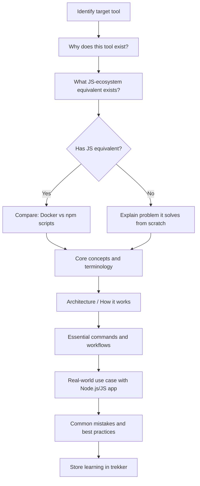
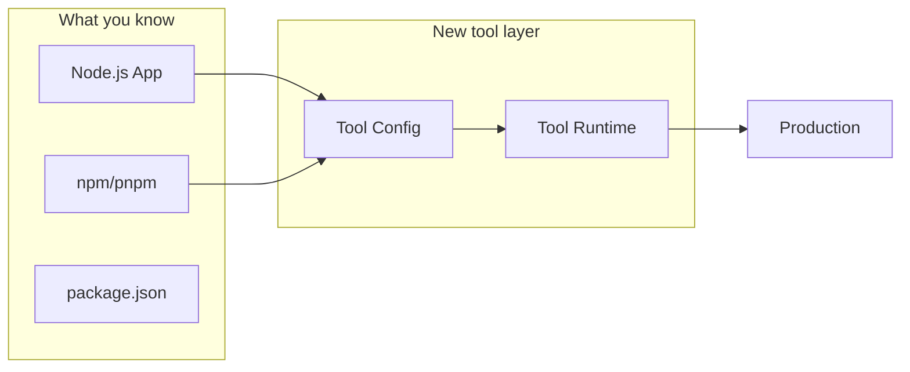

# Tool & Platform Learning — JS Developer Bridge

## Table of Contents
- [Teaching Flow](#teaching-flow)
- [Tool Exploration Template](#tool-exploration-template)
- [Concept Mapping](#concept-mapping)
- [Hands-On Patterns](#hands-on-patterns)

---

## Teaching Flow



## Tool Exploration Template

```markdown
## [Tool Name]

### What & Why
**Problem it solves:** [1 sentence]
**JS-world analogy:** [Closest thing a JS dev knows — e.g., "Docker is like a portable node_modules + runtime"]
**When you need it:** [Concrete scenarios]

### Architecture

\`\`\`mermaid
[Diagram showing how the tool works internally]
\`\`\`

### Core Concepts

| Tool Concept | JS Equivalent | Key Difference |
|-------------|---------------|----------------|
| [concept] | [JS thing] | [what's different] |

### Essential Workflow

\`\`\`bash
# Step-by-step with the most common commands
\`\`\`

### With a Node.js App
[Show how this tool is used with a real JS/Node project]

### Gotchas for JS Devs
- [Common mistake #1]
- [Common mistake #2]

### Industry Standard Setup
[Production-grade configuration and why]
```

## Concept Mapping

Map tool concepts to JS developer mental models:

| Tool Domain | JS Dev Knows | Tool Equivalent |
|-------------|-------------|-----------------|
| Containerization | node_modules, .nvmrc, package.json | Dockerfile, image, container |
| Orchestration | pm2, docker-compose | Kubernetes pods, services, deployments |
| CI/CD | GitHub Actions, npm scripts | Pipeline concepts, stages, artifacts |
| Cloud | Vercel, Netlify | AWS/GCP/Azure services, IaC |
| Databases | MongoDB/Mongoose, Prisma | SQL, ORMs, migrations in target |
| Message Queues | EventEmitter, callbacks | RabbitMQ, Kafka, Redis Pub/Sub |
| Monitoring | console.log, Sentry | Prometheus, Grafana, ELK |

## Hands-On Patterns

### Pattern: Progressive Complexity
Start with the simplest working example, then layer complexity:

1. **Hello World** — minimum viable usage
2. **With a real app** — integrate with a Node.js/Express project
3. **Production config** — what changes for production
4. **Debugging** — what to do when things break

### Pattern: Comparison Table
When the tool has alternatives, compare them:

```markdown
| Feature | Tool A | Tool B | Tool C |
|---------|--------|--------|--------|
| Learning curve | Easy | Medium | Hard |
| JS ecosystem support | Great | Good | Limited |
| Production readiness | Yes | Yes | Emerging |
| Community size | Large | Medium | Small |

**Recommendation:** [Which one and why for a JS developer]
```

### Pattern: Architecture Diagram
Always include a mermaid diagram showing how the tool fits into the JS developer's existing workflow:


