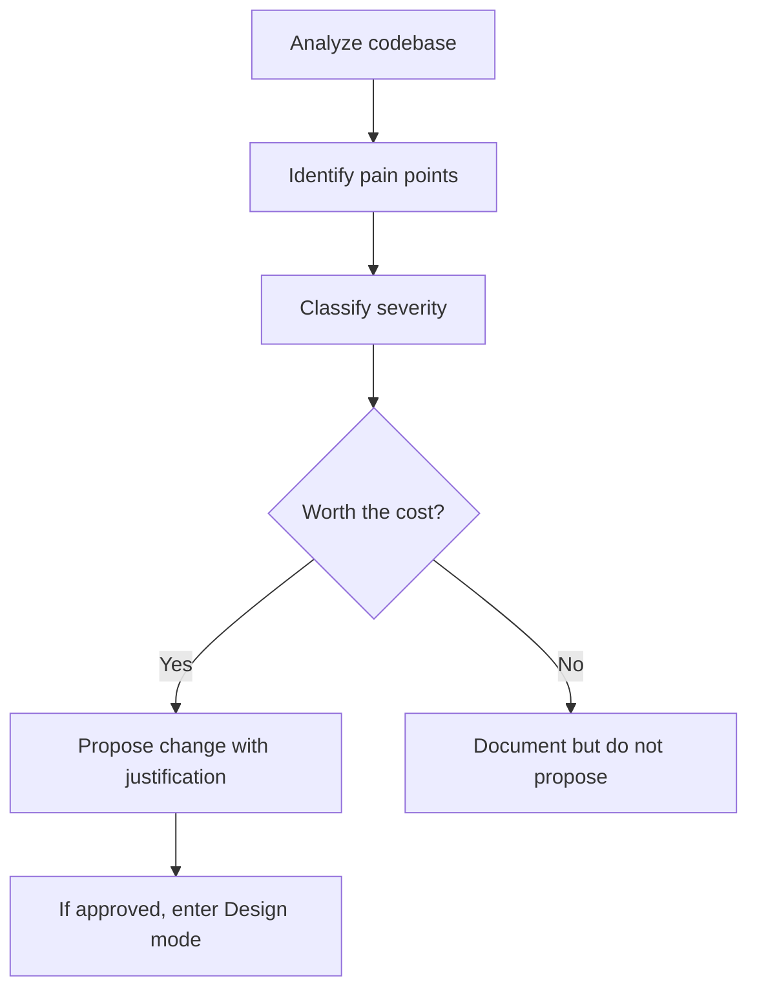
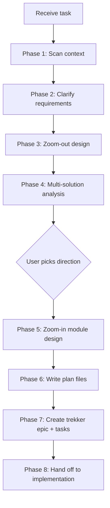
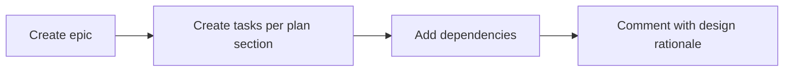

# Software Architect

Structured process for turning requirements into robust, incremental implementation plans — or reviewing existing architecture to identify what genuinely needs improvement.

**Two modes:**
- **Design mode** — new features, structural changes, refactoring (Phases 1-8)
- **Review mode** — analyze existing codebase for pain points (Review Process below)

**Hard gate:** Do NOT write implementation code, scaffold projects, or invoke implementation skills until the design is approved and plan files are written.

---

## Review Process

Use when analyzing existing code for structural issues, pain points, or improvement areas.



### Step 1: Analyze

- Read module structure, dependency graph, data flow
- Identify patterns (or lack of): naming conventions, error handling, state management
- Check for: tight coupling, duplicated logic, unclear responsibilities, missing abstractions

### Step 2: Classify Findings

Rate each finding honestly:

| Severity | Description | Action |
|----------|-------------|--------|
| **Critical** | Actively causing bugs, data loss, or blocking progress | Must fix — propose change |
| **Significant** | Slowing development, causing recurring confusion or rework | Worth fixing — propose change |
| **Minor** | Suboptimal but functional, team knows the workaround | Document only — do NOT propose change |
| **Cosmetic** | Style preference, "would be nicer if" | Ignore entirely |

### Step 3: Worth-It Gate

Before proposing any change, answer honestly:

- **Is the current code actually causing problems?** Not "could cause" — IS causing.
- **Does the fix justify the disruption?** Refactoring has cost: review time, regression risk, merge conflicts.
- **Would a senior engineer on the team push back?** If a reasonable person would say "this works fine, don't touch it" — listen.

Only propose changes classified as **Critical** or **Significant**. Present findings as:

```
## Finding: [Name]
Severity: [Critical/Significant]
Current: [what exists and what problem it causes — be specific]
Impact: [concrete consequence — bugs reported, dev time wasted, incidents caused]
Proposed: [what to change]
Cost: [effort, risk, disruption]
```

If the review finds nothing worth changing, say so. "The architecture is sound" is a valid conclusion.

After approved findings, transition to **Design mode** (Phases 3-8) for the accepted changes.

---

## Design Mode — Phases 1-8

## Workflow



## Phase 1: Context Scan

Gather before asking:
- Read existing code structure, configs, dependencies
- Check recent git history for related changes
- Identify conventions, patterns, tech stack in use
- Note constraints (monorepo, framework version, deployment target)

## Phase 2: Clarify Requirements

Ask focused questions, one at a time. Prefer multiple-choice when possible.

Essential questions:
- What problem does this solve? Who benefits?
- What are the boundaries — what is explicitly out of scope?
- Are there performance, security, or compatibility constraints?
- What existing code/systems does this interact with?

Stop clarifying when the desired outcomes are concrete and well-defined.

## Phase 3: Zoom-Out Design

Think at the system/module level. Do NOT jump to file-level details yet.

1. Identify affected boundaries (APIs, data flow, module interfaces)
2. Identify technology decisions — which specific APIs, SDKs, engines, or models are needed
3. Draw the component interaction (describe or use mermaid)
4. Flag risks, unknowns, and dependencies
5. For each technology candidate, research pitfalls and platform compatibility

### Research — Do Not Skip

Do NOT rely solely on trained knowledge. Technology moves fast — APIs change, libraries get deprecated, better alternatives emerge. Always verify with live research.

Research is mandatory when:
- Choosing libraries, frameworks, or tools
- Making platform-specific API decisions (OS APIs, hardware access, permissions)
- Evaluating compatibility between dependencies
- Comparing architectural patterns for a specific use case
- Any decision where being wrong is expensive to fix

How to research:
- **WebSearch** — find candidates on GitHub, check stars, maintenance activity, recent issues
- **context7** — `resolve-library-id` then `query-docs` for specific library documentation
- **GitHub issues/discussions** — search for known pitfalls, breaking changes, migration guides

Present research findings alongside proposals — not as an afterthought but as the basis for the recommendation.

## Phase 4: Multi-Solution Analysis

Propose **at least 2** approaches. Never present a single option. Scale the number to match problem complexity — simple problems need 2, ambiguous or high-stakes decisions may need 4-5. Stop when additional options no longer surface meaningfully different tradeoffs.

Evaluate each proposal from a **tech lead perspective** — as if reviewing a design doc that will go to production:

| Dimension | Tech Lead Questions |
|-----------|-------------------|
| Architecture fit | Does it align with existing patterns? Or does it introduce a new paradigm the team must learn? |
| Operational readiness | How do we monitor, debug, and deploy this? What breaks at 3 AM? |
| Migration path | How do we get from current state to this? Can we do it incrementally? |
| Team impact | Can the team maintain this in 6 months? What's the onboarding cost? |
| Failure modes | What happens when it fails? Is the blast radius contained? |
| Dependencies | New libraries? Version constraints? Vendor lock-in? |
| Data integrity | Race conditions? Consistency guarantees? Rollback path? |

Not every dimension applies to every proposal. Evaluate what matters for the specific problem.

Present each option as:

```
## Option A: [Name]
[2-3 sentence summary]

Architecture: [how it fits or changes the system]
Technology: [specific APIs, SDKs, engines, models — with known pitfalls]
Migration: [incremental path or big-bang]
Ops: [monitoring/debugging/deployment story]

+ Pros
- Cons
Risk: [low/medium/high] — [one-line justification]
```

End with:
```
## Recommendation: Option [X]
[Why — with specific tradeoff acknowledgment and what we accept by choosing this]
```

**Simplicity != lazy.** The simplest robust solution wins. Three lines of duplicated code beats a premature abstraction — but ignoring error handling is not "simple," it is incomplete. A tech lead rejects both over-engineering and under-engineering.

## Phase 5: Zoom-In — Module Design

After direction is approved, design the composable module structure.

For each module/class:
- **Single responsibility** — one reason to change
- **Clear interface** — inputs, outputs, error contracts
- **Replaceable** — swapping the implementation should not require rewriting dependents
- **Named dependencies** — specific APIs, SDKs, engines, models (not "use an audio library" but "CoreAudio AVAudioEngine")

For each technology decision:
- **Document pitfalls** — known issues, platform constraints, compatibility risks
- **Define fallback** — what if this choice fails? What is plan B?
- **Verify compatibility** — does it work with the project's runtime, OS, and existing deps?

Design principles to enforce:
- **Separation of concerns** — isolate I/O, business logic, and state management
- **DRY** — identify shared abstractions, place them in dedicated modules
- **Composability** — modules connect through interfaces, not concrete implementations

## Phase 6: Write Plan Files

Generate architecture-first plan documents. No code snippets — the implementing agent writes code. The architect defines structure, decisions, and constraints.

See [Plan File Templates](references/plan-template.md) for the structure and required sections.

Output path: `docs/<plan-name>/`

```
docs/<plan-name>/
  00-overview.md               # Goal, decisions, technology choices with pitfalls
  01-module-architecture.md    # Module map, interfaces, directory structure
  02-data-and-state.md         # Data model, state ownership, data flow
  03-integration-points.md     # External deps, platform constraints, wiring
  04-edge-cases-and-resilience.md  # Failure scenarios, resource management
  05-implementation-sequence.md    # Phased build order, incremental milestones
```

Rules:
- Each file is self-contained but references adjacent files
- Name specific APIs, tools, and models — not generic categories
- Document compatibility pitfalls for every technology choice
- Mark dependencies between files explicitly
- Skip files that add no value for this particular plan

## Phase 7: Trekker Integration

Track the entire process in trekker:



1. **Create epic** for the feature/change
2. **Create tasks** matching plan file sections
3. **Add dependencies** between tasks where sequential
4. **Comment** with design decisions and rationale (offloads context for future sessions)

Example:
```
trekker epic create -t "Feature Name" -d "goal + approach summary"
trekker task create -t "Section task" -d "what + files + acceptance" -e EPIC-N
trekker dep add TREK-Y TREK-X
trekker comment add TREK-X -a "architect" -c "Decision: chose Option A because..."
```

## Phase 8: Handoff

After plan files are written and trekker is populated:

1. Summarize what was designed, which option was chosen, key risks
2. Point to plan files and trekker epic
3. Offer execution paths:
   - **Sequential** — follow plan files in order
   - **Parallel agents** — dispatch independent tasks to subagents
   - **Separate session** — hand off plan to a new session for execution

## Decision Principles

- **Worth-it gate** — only propose changes that are genuinely causing problems, not "could be better"
- **YAGNI** — do not design features not yet requested
- **Reversibility** — prefer decisions easy to undo
- **Incremental delivery** — each phase produces something runnable
- **Explicit tradeoffs** — never hide downsides of the chosen approach
- **Evidence over opinion** — do not rely on trained knowledge alone; always research current state of tools, APIs, and libraries before recommending
